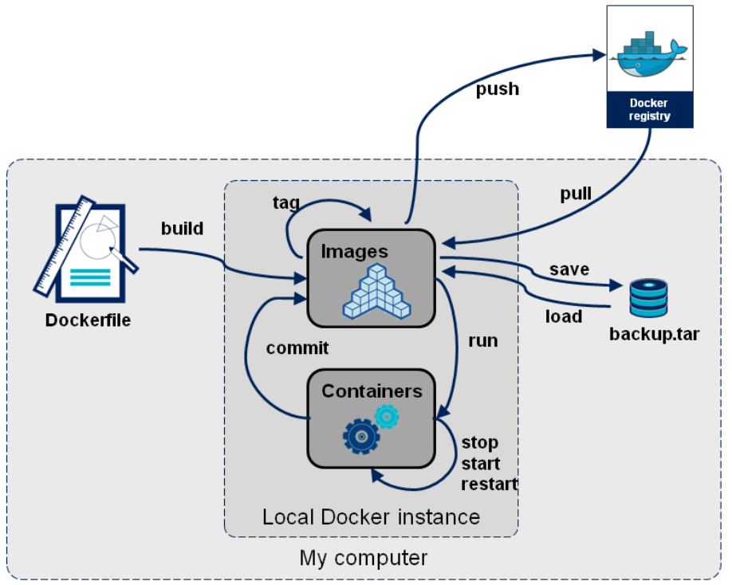

# The ways to get Image
## pull from registry
## build from Dockerfile
## load from file

# registry
## Dockerhub
## RED HAT

# commit a container as a image
```
docker commit test test:v1
```

# use Buildkit to faster docker build
https://dockertips.readthedocs.io/en/latest/docker-image/buildkit.html