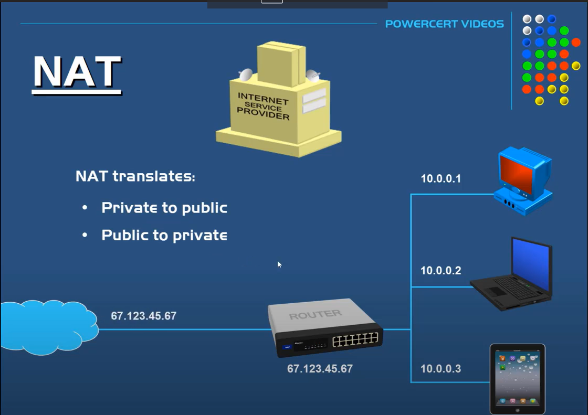
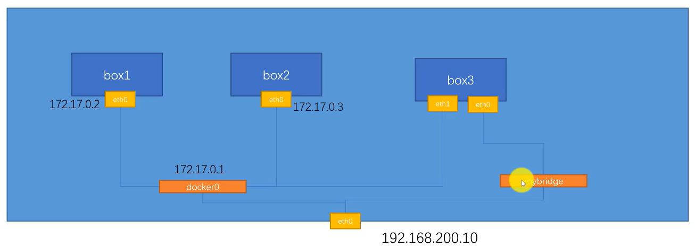

# 測試網路是否通
## ping 192.168.178.1
## telnet www.google.com 80

# 追蹤路徑
## tracepath www.google.com

# curl命令:發request
## https://www.ruanyifeng.com/blog/2019/09/curl-reference.html

# NAT: Network Address Translation
## 將private ip轉成public ip再和網路的人互動
## 將public ip獲得的訊息再轉換成private ip


# add a bridge
## -d driver
## --gateway 手動設置gateway
## --subnet 手動設置subnet
```
docker network create -d bridge --gateway 172.200.0.1 --subnet 172.200.0.0/17 mybridge
```

# container adds/deletes a connection to bridge
```
docker network connect/disconnect bridge box3
```


# 在自己創建的docker bridge, 可以使用container name去ping

# host network = local network

# none network 建立沒有網路的container